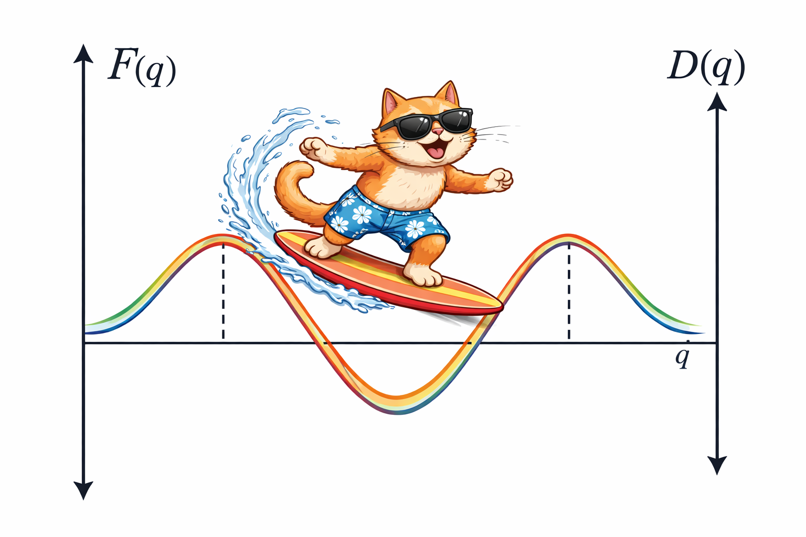

# Position-Diffusion

  

This directory contains source code that can be used to reproduce the results of Example 1 of our manuscript "A variational method for efficient estimation of diffusion and free-energy profiles along collective variables". The manuscript is available on [bioRxiv](https://www.biorxiv.org/content/10.64898/2026.01.01.697292v1). We welcome suggestions for improving the code.

### Auhors: 
Anže Hubman & Franci Merzel (Theory department, National Institute of Chemistry, Slovenia)

### Dependencies:
- python3
- numpy
- scipy
- matplotlib
- numba

Disclaimer: The image above was generated using ChatGPT.
